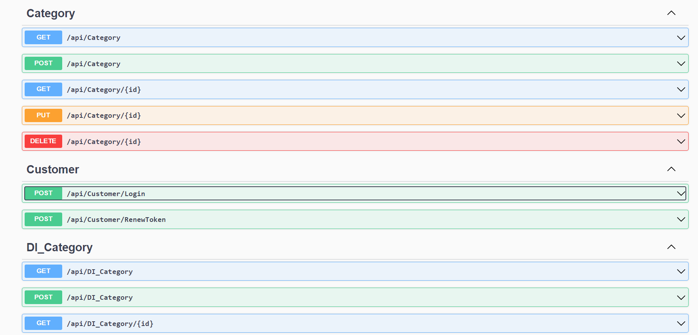

# Portfolio
---
## Airline reservation management website

Deploys ASP.NET application with Azure SQL Database on Microsoft Azure Cloud. See website at [***Airline reservation management***](https://airline-reservation-dbserver.database.windows.net/).

**Introduction** signup/signin, authentication, authorization, search for information. Administrators can CRUD and manage.
 

    
    

 

**Technologies** .Net Framework7 MVC, Linq, Entity Framework6, SQL Server, Identity Server7, Azure Data
Studio, Docker.

**Beside** Design system operating procedures through ERD, Sequence diagram, Activity diagram, Use
case, DFD, BFD, Test case.
 

    
    

 

---
### Web API Ecommerce 

Allows access, user authentication, use of services and features without needing to access
website's interface.

**Technologies** ASP.NET Core MVC 6, WebAPI, Restful API, Fluent API, Entity Framework, SQL Server,Postman.
 

 

---
### Online Shoes Shopping System
See website at [***Shoes Website***](https://ld-shoe-php.000webhostapp.com/).

This online shopping system has three modules namely Admin, Employee and Client. Admin
can CRUD products, add new employees, grant permissions for Employees to view/edit/create. Users are
allowed to sign up/sign in (by external provider: google or regular login by authenticating account via
gmail), shop, store products in the shopping cart even if the website is turned off and view purchase
history.

    
    

**Technologies** PHP, Javascript, SQL, MySQL Workbench, Ajax, JQuery, Bootstrap.

**Services** Twilio SMS (Authentication), PHPMailer (Authentication), OAuth 2.0 to Access Google APIs
(Authorization).

---

© 2024 Linh Dan. Powered by Jekyll and the Minimal Theme.

